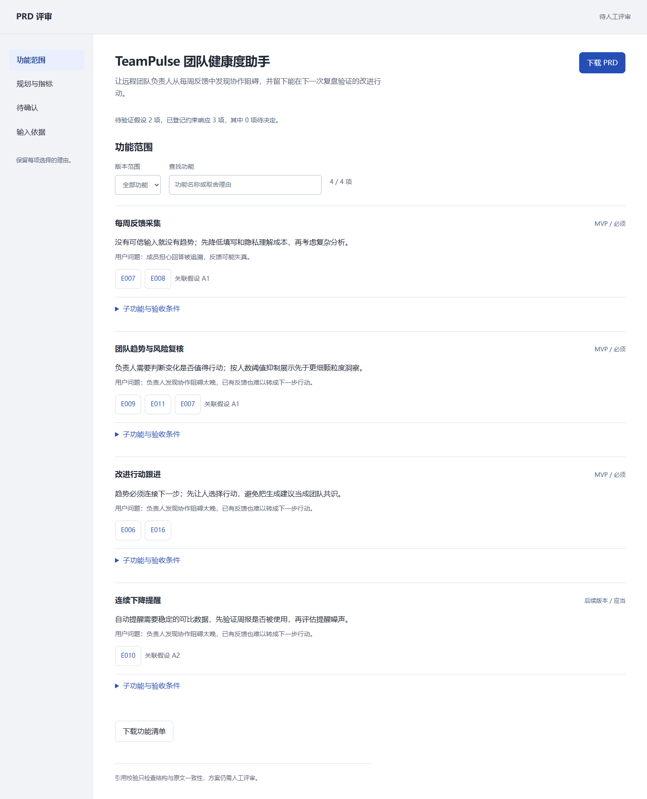

# PRD Research Agent

## 面试官 30 秒版

把零散需求转成能逐项追问依据的产品方案。宿主 AI 或产品负责人负责理解业务和作出取舍；本地工具负责保留原文、校验引用和依赖、生成 PRD、验收清单与可交互评审页。

0.3 版移除了按关键词套用行业功能和按顺序分配优先级的逻辑。仅提供需求时输出资料梳理；提交明确的产品方案后才输出功能。每项功能关联用户问题、原始依据或待验证假设。

[产品决策案例](docs/product-case.md) | [本轮验收](docs/evidence-review-acceptance.md) | [输入契约](schemas/input.schema.json) | [方案契约](schemas/plan.schema.json)

## 三分钟体验

需要 Python 3.10+。安装依赖后，下面的演示完全离线，不需要模型密钥。方案文件是预先编写的虚构案例，不是假装脚本自动理解了行业。

```bash
python -m pip install -r requirements.txt
python scripts/plugin_run.py --input examples/plugin-input.json --plan examples/team-pulse-plan.json --output-dir output/team-review
```

打开 `output/team-review/review.html`：筛选 MVP、展开子功能与验收条件、点击依据回到原文、返回当前功能、下载 PRD 和 backlog。页面自包含，无服务器、无 CDN、无浏览器持久存储。再次运行请用新的输出目录，已有结果不会覆盖。

另一份跨行业案例：

```bash
python scripts/plugin_run.py --input examples/fitcheck-input.json --plan examples/fitcheck-plan.json --output-dir output/fitcheck-review
```

FitCheck 是汽车售后虚构需求，覆盖本地 CSV、适配异常、人工复核和资料过期。它展示技能如何完成产品定义，不代表仓库实现了汽车适配系统。

不用运行代码也可直接阅读已生成的 [TeamPulse PRD](examples/team-pulse-prd.md) 和 [FitCheck PRD](examples/fitcheck-prd.md)。CI 会检查它们与当前方案和渲染器一致。



[手机视图](docs/screenshots/review-mobile.png)

## 处理自己的需求

将需求写入 JSON 的 `requirement_markdown`，可附竞品记录，运行：

```bash
python scripts/plugin_run.py --input my-brief.json --output-dir output/assessment
```

得到 `needs_plan` 和原始依据。使用插件中的 [skill](skills/prd-research-agent/SKILL.md)，让宿主 AI 按方案契约读取这些材料并编写计划；也可以人工编写。再通过 `--plan` 校验和生成评审稿。脚本本身不调用模型或联网，不会从一段文字自动推导正确的商业方案。

Windows 的 `python` 如不可用，可以改用 `py -3`；终端中文编码有问题时加 `-X utf8`。

## 交付内容

| 文件 | 使用目的 |
|---|---|
| `result.md` | 完整 PRD 或输入资料梳理，包含原文与引用 |
| `result.json` | 版本 2.0 的结果、方案、检查状态和输入指纹 |
| `backlog.json` | 按用户故事展开的功能、优先级、依赖与验收条件 |
| `review.html` | 本地可交互评审页，直接打开即可用 |

已实现的检查包括原文引用匹配、输入变更后方案失效、角色与问题关联、依赖循环、MVP 前置条件、约束响应、指标目标来源和发布次序。`review_ready` 表示可以开始人工评审，不是批准上线，也不是需求或业务价值已得到验证。

## 兼容原有 CLI

```bash
python scripts/generate_prd.py --input examples/sample_requirement.md --competitors examples/sample_competitors.csv --output examples/generated_prd.md --rules configs/prd_rules.yaml --dry-run
```

该命令继续离线写文件；缺少 `--plan` 时只写资料梳理，明确列出功能和验收尚待决定。加 `--plan examples/team-pulse-plan.json` 可生成完整示例。`--rules` 保留用于命令兼容，不再加载旧功能模板。

## 测试与维护

```bash
python -m unittest discover -s tests -v
npm ci
npx playwright install chromium
npm run test:review
powershell -ExecutionPolicy Bypass -File scripts/portfolio_audit.ps1
```

浏览器检查是开发验收，不是使用插件的依赖。已有 Chrome 时设置 `BROWSER_CHANNEL=chrome`；自选 Python 环境时设置 `PYTHON`。

[插件使用](docs/plugin.md) | [工作流](docs/workflow.md) | [开源依赖](docs/open-source.md) | [变更记录](CHANGELOG.md)

没有真实用户参与、没有业务效果基线，也未部署多人协作服务。已交付的是可复现的本地需求评审工具与 AI 宿主技能。
