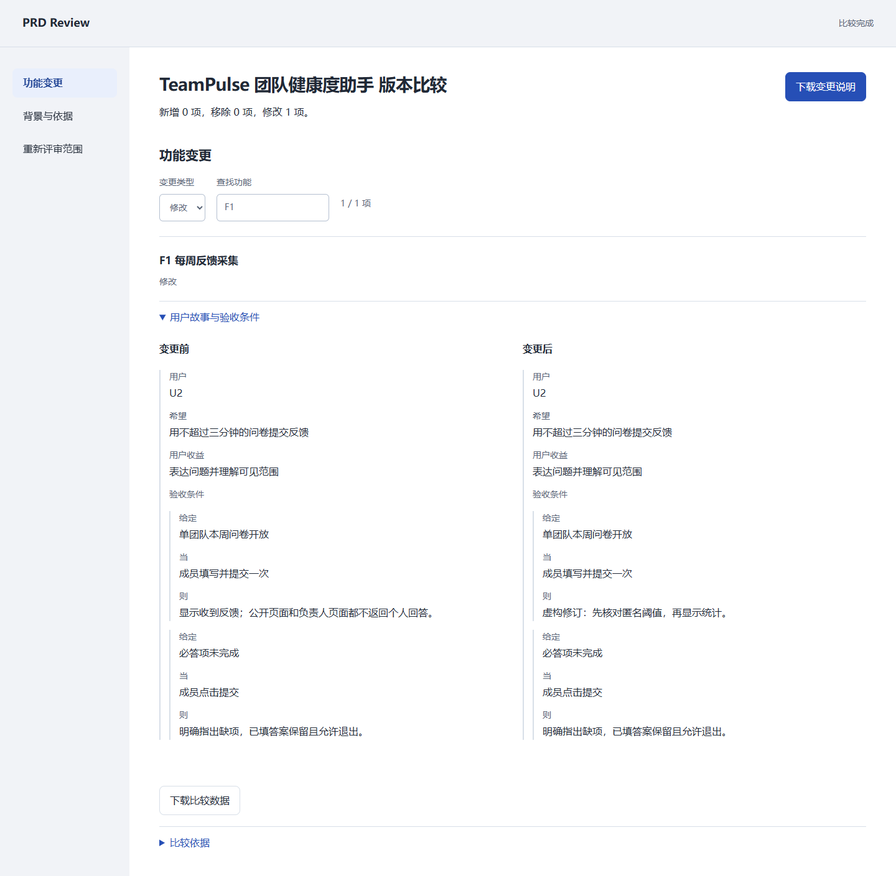

# 版本比较：变更之后重看什么

日期：2026-09-18。版本：0.4.0。案例全部虚构，没有真实用户效果数据。

## 可以直接运行

安装 Python 依赖后，使用三个尚不存在的输出目录：

```bash
python scripts/plugin_run.py --input examples/plugin-input.json --plan examples/team-pulse-plan.json --output-dir output/compare-before
python scripts/plugin_run.py --input examples/plugin-input.json --plan examples/team-pulse-revision-plan.json --output-dir output/compare-after
python scripts/compare_revisions.py --before output/compare-before/result.json --after output/compare-after/result.json --output-dir output/compare-review
```

直接打开 `output/compare-review/review.html`。示例把 F1 的问卷缺项反馈从笼统指出缺项，改成定位第一处缺项并保留已填答案；F2、F3、F4 因依赖关系进入重新评审候选。没有声称这个变化已经实现或带来客户收益。

比较页可以筛选变更类型、搜索名称或编号、查看完整字段前后值、阅读背景变化与依赖提示，以及下载 Markdown 和 JSON。桌面前后并排，手机上下阅读。嵌套字段只展示结构化内容，不生成模型推理过程。



[手机比较页](screenshots/comparison-mobile.png)

## 数据与取舍

- 输入为两份含有效方案的 2.0 `result.json`，每份文件最多 8 MB。重新执行方案与证据校验，不信任缓存的摘要、检查结果和 backlog。
- 按稳定功能 ID 对齐。名称变化是字段修改；ID 变化是新增和移除。产品名称不同默认拒绝，仅显式 `--allow-product-rename` 放行。
- 同时遍历新旧依赖图的传递关系，提供保守的重新评审候选。背景或输入变动提示全部现有功能；不是语义影响分析，也不是已确认缺陷。
- 同一字段内的数组按完整前后值展示，不猜测故事的移动或改名。仅功能数组重排会记录显示次序，不生成优先级变化。
- 快照摘要是可重复的内容指纹，不是签名或来源真实性证明。攻击者同时改写合法输入和方案仍可形成合法新快照。
- 输出限定于仓库 `output/` 的新子目录，不覆盖旧结果。HTML 自包含，无网络请求、账号或浏览器持久存储。分享页面会分享其中的原始材料。

## 本地技术验收

`python -m unittest discover -s tests -v`：39 项通过，其中 11 项覆盖版本比较，包括过期/篡改依据、依赖传递、移除依赖、编号变化、输入变化、名称变更、缓存隔离、HTML 注入与重复输出目录保护。

`npm run test:comparison`：真实 Chrome，1440 和 390 像素宽度，6 类固定输入。通过类型筛选、无结果状态、验收条件展开、键盘操作、导航焦点、背景变化、四项依赖候选、增删编号、无变化和单纯换序检查。Markdown 下载逐字节匹配，JSON 下载结构匹配；两个尺寸都无脚本异常、横向溢出、HTTP 请求或自动 axe WCAG A/AA 违规。自动可访问性检查不等同于完整人工无障碍认证。

证据：[浏览器检查结果](evaluation/revision-comparison-browser.json)。CI 会重新生成证据和截图。

Impeccable 检查按两轮截图完成：第一轮发现嵌套缩进过深，统一修复后第二轮确认。机械扫描缺少 HTML 解析依赖，退化为正则扫描，返回空发现只能视为有限证据；布局与对比度使用渲染截图和 axe 单独核查。

## 尚未完成

逐项人工确认与审批留痕、多人同时编辑、语义影响预测、真实评审任务完成率和客户节省时间均未验收。当前交付是离线变更审阅能力。
