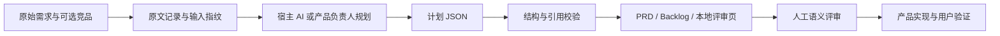

# 从需求到评审

1. 读取原文，识别用户的任务和失败成本。没有独立标题的自然段也可能已经给出了足够资料。
2. 运行插件获取 evidence 和 analysis_id；没有计划时交付资料梳理。
3. 宿主或人作出范围、优先级和假设判断，按方案契约写 JSON。
4. 校验引用、指纹、依赖和约束；错误在输出目录创建前返回。
5. 在评审页筛选 MVP、展开验收、点击依据回看原文；下载一致的 Markdown 和 backlog。
6. 产品负责人判断推论是否有意义，未验证的假设进入验证计划。后续开发和用户研究不包含在脚本的成功状态里。

本地执行没有等待中的远程生成，因此不模拟“AI 思考”动画。加载完成即展示内容，状态变化使用简短的选择和高亮反馈。
